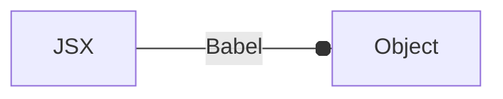

# React and Nextjs
## React Basics
- Single page application (SPA)
- DOM Manipulation --> repainting when browsing pages
- **React fragments** used to wrap multiple elements
- Components name need to be start with *capitals*
- Injecting JS in the JSX requires only `Evaluated JS expression` and not any **JS expression**

## custom react syntax

**the react components (JSX) are transpiled into an object like syntax which is rendered inside the DOM**
The object structure is similar to the given below:


```js
// React.createElement(type, attributes, text, variables)

const myElement = {
    type: 'a',
    children: 'Click here',
    props: {
        href: 'https://github.com'
        target: '_blank'
    }
}

//  using React to create the custom elements
// that don't require parsing

React.createElement(
    'a',
    {href: 'google.com', target: '_blank'},
    "click me",
)
```


## ContextAPI
The problem of prop-drilling is solved using **state management** and context. ContextAPI is the react solution for state management

<svg version="1.1" xmlns="http://www.w3.org/2000/svg" viewBox="0 0 750.8867272231128 426.1813200567241" width="750.8867272231128" height="426.1813200567241">
  <!-- svg-source:excalidraw -->

  <defs>
    <style class="style-fonts">
      @font-face {
        font-family: "Virgil";
        src: url("https://excalidraw.com/Virgil.woff2");
      }
      @font-face {
        font-family: "Cascadia";
        src: url("https://excalidraw.com/Cascadia.woff2");
      }
      @font-face {
        font-family: "Assistant";
        src: url("https://excalidraw.com/Assistant-Regular.woff2");
      }
    </style>

  </defs>
  <rect x="0" y="0" width="750.8867272231128" height="426.1813200567241" fill="#ffffff"></rect><g stroke-linecap="round" transform="translate(38.75618712719415 126.91550962154383) rotate(0 198.37109596417918 136.42914949317202)"><path d="M32 0 C129.53 0.46, 225.36 1.9, 364.74 0 M32 0 C113.24 -0.22, 192.98 0.69, 364.74 0 M364.74 0 C387.85 1.67, 395.01 9.72, 396.74 32 M364.74 0 C383.92 -0.76, 394.45 10.42, 396.74 32 M396.74 32 C398.86 92.01, 397.09 152.85, 396.74 240.86 M396.74 32 C397.1 104.9, 396.15 179.45, 396.74 240.86 M396.74 240.86 C397.87 260.66, 384.69 272.36, 364.74 272.86 M396.74 240.86 C398.24 264.24, 384.35 270.71, 364.74 272.86 M364.74 272.86 C267.69 270.52, 172.9 271.63, 32 272.86 M364.74 272.86 C278.12 270.88, 191.55 270.34, 32 272.86 M32 272.86 C9.59 272.8, -1.11 260.35, 0 240.86 M32 272.86 C10.12 272.56, -1.74 262.64, 0 240.86 M0 240.86 C-2.72 190.32, -2.43 141.84, 0 32 M0 240.86 C1.66 157.33, 1.4 74.83, 0 32 M0 32 C1.84 11.63, 11.23 -0.42, 32 0 M0 32 C-0.43 12.83, 9.18 -0.28, 32 0" stroke="#1e1e1e" stroke-width="2" fill="none"></path></g><g transform="translate(78.58723050643437 79.08691081880659) rotate(0 53.683578445538615 17.9808453270482)"><text x="0" y="25.201952810390804" font-family="Virgil, Segoe UI Emoji" font-size="28.76935252327717px" fill="#1e1e1e" text-anchor="start" style="white-space: pre;" direction="ltr" dominant-baseline="alphabetic">&lt;App /&gt;</text></g><g stroke-linecap="round" transform="translate(76.39181680137358 155.14222649335932) rotate(0 148.97435220613988 27.834688708718545)"><path d="M13.92 0 C92.74 1.81, 169.52 1.86, 284.03 0 M13.92 0 C100.33 0.3, 188.3 1.17, 284.03 0 M284.03 0 C291.39 0.07, 297.62 5.29, 297.95 13.92 M284.03 0 C294.7 -0.21, 298.23 4.43, 297.95 13.92 M297.95 13.92 C299.7 21.58, 298.35 26.09, 297.95 41.75 M297.95 13.92 C297.56 21.16, 298.96 26.22, 297.95 41.75 M297.95 41.75 C296.84 52.2, 294.87 55.63, 284.03 55.67 M297.95 41.75 C300.12 53.04, 295.22 57.74, 284.03 55.67 M284.03 55.67 C206.38 55.71, 132.16 56.09, 13.92 55.67 M284.03 55.67 C215.11 54.23, 146.48 53.32, 13.92 55.67 M13.92 55.67 C5.33 54.25, -1.37 52.07, 0 41.75 M13.92 55.67 C3.23 56.26, 0.93 49.4, 0 41.75 M0 41.75 C0.94 33.48, 1.56 23.34, 0 13.92 M0 41.75 C0.07 33.98, -0.72 27.41, 0 13.92 M0 13.92 C1.31 4.86, 3.21 -0.55, 13.92 0 M0 13.92 C2.26 4.32, 5.54 0.28, 13.92 0" stroke="#1e1e1e" stroke-width="2" fill="none"></path></g><g stroke-linecap="round" transform="translate(83.44847448405153 244.5268658129021) rotate(0 148.19028511230783 60.37382305098117)"><path d="M30.19 0 C106.2 0.08, 179.88 -1.15, 266.19 0 M30.19 0 C82.7 -0.96, 135.77 -1.27, 266.19 0 M266.19 0 C285.01 -0.23, 297.61 9.69, 296.38 30.19 M266.19 0 C285.4 1.15, 296.75 10.64, 296.38 30.19 M296.38 30.19 C297.99 51.24, 294.93 70.25, 296.38 90.56 M296.38 30.19 C295.8 51.98, 297.07 72.06, 296.38 90.56 M296.38 90.56 C295.29 110.46, 288.22 120.71, 266.19 120.75 M296.38 90.56 C294.35 111.82, 287.35 121.32, 266.19 120.75 M266.19 120.75 C203.37 122.05, 141.41 120.24, 30.19 120.75 M266.19 120.75 C215.4 122.39, 164.23 121.69, 30.19 120.75 M30.19 120.75 C9.56 119.41, -1.42 112.34, 0 90.56 M30.19 120.75 C11.51 119.1, -1.06 110.43, 0 90.56 M0 90.56 C-1.41 65.96, -0.59 40.56, 0 30.19 M0 90.56 C-0.39 73.43, -0.65 54.55, 0 30.19 M0 30.19 C-0.54 10.98, 10.19 1.37, 30.19 0 M0 30.19 C-0.66 11.39, 8.64 1.2, 30.19 0" stroke="#1e1e1e" stroke-width="2" fill="none"></path></g><g stroke-linecap="round" transform="translate(126.57264918852087 296.2758323877133) rotate(0 96.83332516531758 28.226716871815597)"><path d="M14.11 0 C57.01 -1.85, 101.05 0.16, 179.55 0 M14.11 0 C75.87 0.02, 139.53 0.68, 179.55 0 M179.55 0 C189.67 0.7, 193.79 6.36, 193.67 14.11 M179.55 0 C188.51 -1.19, 192.71 6.68, 193.67 14.11 M193.67 14.11 C195.48 22.6, 192.38 34.52, 193.67 42.34 M193.67 14.11 C193.82 25.79, 194 35.09, 193.67 42.34 M193.67 42.34 C192.3 50.37, 187.38 57.27, 179.55 56.45 M193.67 42.34 C192.97 51.17, 190.22 54.64, 179.55 56.45 M179.55 56.45 C132.09 57.43, 81.87 55.24, 14.11 56.45 M179.55 56.45 C138.65 56.78, 97.42 56.07, 14.11 56.45 M14.11 56.45 C3.88 56.57, -0.92 52.27, 0 42.34 M14.11 56.45 C3.03 56.07, 0.38 50.99, 0 42.34 M0 42.34 C-1.3 33.99, 0.68 23.58, 0 14.11 M0 42.34 C-0.52 32.05, 0.33 21.62, 0 14.11 M0 14.11 C1.27 5.08, 4.4 -0.26, 14.11 0 M0 14.11 C-0.13 5.52, 6.45 0.42, 14.11 0" stroke="#1e1e1e" stroke-width="2" fill="none"></path></g><g transform="translate(101.7958404507317 167.06017122420656) rotate(0 44.27272296329505 12.492311064396347)"><text x="0" y="17.50922318785795" font-family="Virgil, Segoe UI Emoji" font-size="19.98769770303419px" fill="#1e1e1e" text-anchor="start" style="white-space: pre;" direction="ltr" dominant-baseline="alphabetic">&lt;Login /&gt;</text></g><g stroke-linecap="round" transform="translate(483.3270209288419 14.7927307633895) rotate(0 115.65110769949348 121.13966349742128)"><path d="M145 30.5 C167.78 55.89, 190.01 80.57, 202.3 91.5 M145 30.5 C166.77 55.52, 190.76 79.37, 202.3 91.5 M202.3 91.5 C233.12 121.52, 232.99 122.45, 202.3 152.5 M202.3 91.5 C232.14 123.46, 229.23 123.69, 202.3 152.5 M202.3 152.5 C190.82 164.79, 176.68 178.31, 145 211.78 M202.3 152.5 C180.76 175.27, 157.99 197.19, 145 211.78 M145 211.78 C115.01 241.44, 115.32 242.63, 87 211.78 M145 211.78 C117.44 241.64, 116.77 240.6, 87 211.78 M87 211.78 C72.59 194.18, 52.95 177.46, 29 152.5 M87 211.78 C65.99 190.97, 47.67 171.54, 29 152.5 M29 152.5 C0.64 122.55, 0.32 120.18, 29 91.5 M29 152.5 C-1.11 121.05, -1.23 123.79, 29 91.5 M29 91.5 C42.86 77, 59.21 57.8, 87 30.5 M29 91.5 C45.13 74.34, 63.02 57.11, 87 30.5 M87 30.5 C115.6 0.37, 116.84 -1.16, 145 30.5 M87 30.5 C113.72 -2.27, 115.15 -0.9, 145 30.5" stroke="#1e1e1e" stroke-width="2" fill="none"></path></g><g transform="translate(532.4101356958205 102.21711082342927) rotate(0 58.489174712961585 33.21741813895159)"><text x="0" y="23.278766631777263" font-family="Virgil, Segoe UI Emoji" font-size="26.573934511161255px" fill="#1e1e1e" text-anchor="start" style="white-space: pre;" direction="ltr" dominant-baseline="alphabetic">username</text><text x="0" y="56.49618477072883" font-family="Virgil, Segoe UI Emoji" font-size="26.573934511161255px" fill="#1e1e1e" text-anchor="start" style="white-space: pre;" direction="ltr" dominant-baseline="alphabetic">usermail</text></g><g mask="url(#mask-F0M1Gk-EYiui-kHQTKUyr)" stroke-linecap="round"><g transform="translate(196.2730602426617 177.8641063092166) rotate(359.54790275680347 170.6769793507031 -58.04545186395012)"><path d="M-0.9 -0.86 C6.86 -19.2, -10.98 -90.5, 45.88 -109.65 C102.73 -128.8, 290.91 -114.52, 340.22 -115.73 M0.82 1.31 C8.45 -16.92, -12.25 -88.58, 44.7 -108.45 C101.65 -128.31, 292.94 -116.58, 342.52 -117.89" stroke="#1e1e1e" stroke-width="2" fill="none"></path></g><g transform="translate(196.2730602426617 177.8641063092166) rotate(359.54790275680347 170.6769793507031 -58.04545186395012)"><path d="M318.9 -109.69 C323.14 -112.22, 329.2 -115.35, 342.52 -117.89 M318.9 -109.69 C327.12 -111.57, 334.06 -114.04, 342.52 -117.89" stroke="#1e1e1e" stroke-width="2" fill="none"></path></g><g transform="translate(196.2730602426617 177.8641063092166) rotate(359.54790275680347 170.6769793507031 -58.04545186395012)"><path d="M319.16 -126.79 C323.4 -125.2, 329.39 -124.21, 342.52 -117.89 M319.16 -126.79 C327.35 -123.03, 334.21 -119.86, 342.52 -117.89" stroke="#1e1e1e" stroke-width="2" fill="none"></path></g></g><mask id="mask-F0M1Gk-EYiui-kHQTKUyr"><rect x="0" y="0" fill="#fff" width="637.6270189440679" height="393.95501003711684"></rect><rect x="224.93190740209343" y="61.65451841307902" fill="#000" width="34.51808166503906" height="16.35978718789889" opacity="1"></rect></mask><g transform="translate(224.94277403041292 61.6555207001021) rotate(359.54790275680347 142.13972136881796 56.78647827198154)"><text x="17.25904083251953" y="11.464938861279542" font-family="Virgil, Segoe UI Emoji" font-size="13.08782975031911px" fill="#1e1e1e" text-anchor="middle" style="white-space: pre;" direction="ltr" dominant-baseline="alphabetic">store</text></g><g transform="translate(105.40261153465917 250.95624397818324) rotate(0 68.37840359566508 11.708233202926351)"><text x="0" y="16.4102596572216" font-family="Virgil, Segoe UI Emoji" font-size="18.733173124682192px" fill="#1e1e1e" text-anchor="start" style="white-space: pre;" direction="ltr" dominant-baseline="alphabetic">&lt;Dashboard /&gt;</text></g><g transform="translate(146.88015597068608 309.52670302247657) rotate(0 50.87283156634848 14.452516485709225)"><text x="0" y="20.256647106370067" font-family="Virgil, Segoe UI Emoji" font-size="23.12402637713478px" fill="#1e1e1e" text-anchor="start" style="white-space: pre;" direction="ltr" dominant-baseline="alphabetic">&lt;Card /&gt;</text></g><g mask="url(#mask-j3sTuqFOWRURCQ5KJk2N3)" stroke-linecap="round"><g transform="translate(587.6090104046584 245.31092213909608) rotate(0 -128.98040980920723 43.12415316919339)"><path d="M-0.45 0.17 C-5.84 14.69, 11.87 73.22, -31.18 86.11 C-74.23 99.01, -221.04 79, -258.75 77.55 M1.52 -0.78 C-4.12 14.01, 10.93 74.31, -32.04 87.58 C-75 100.85, -218.79 80.36, -256.26 78.84" stroke="#1e1e1e" stroke-width="2" fill="none"></path></g><g transform="translate(587.6090104046584 245.31092213909608) rotate(0 -128.98040980920723 43.12415316919339)"><path d="M-232.1 72.41 C-241.48 75.17, -251.6 76.12, -256.26 78.84 M-232.1 72.41 C-240.13 73.88, -246.31 75.76, -256.26 78.84" stroke="#1e1e1e" stroke-width="2" fill="none"></path></g><g transform="translate(587.6090104046584 245.31092213909608) rotate(0 -128.98040980920723 43.12415316919339)"><path d="M-233.62 89.44 C-242.25 85.44, -251.77 79.61, -256.26 78.84 M-233.62 89.44 C-241.28 85.91, -247.02 82.77, -256.26 78.84" stroke="#1e1e1e" stroke-width="2" fill="none"></path></g></g><mask id="mask-j3sTuqFOWRURCQ5KJk2N3"><rect x="0" y="0" fill="#fff" width="945.5698300230729" height="431.55922847748286"></rect><rect x="534.6378506782714" y="323.3793348835334" fill="#000" width="43.21626281738281" height="16.35978718789889" opacity="1"></rect></mask><g transform="translate(534.6378506782714 323.3793348835334) rotate(0 -75.64337334585332 -32.44286800086104)"><text x="21.608131408691406" y="11.464938861279542" font-family="Virgil, Segoe UI Emoji" font-size="13.08782975031911px" fill="#1e1e1e" text-anchor="middle" style="white-space: pre;" direction="ltr" dominant-baseline="alphabetic">access</text></g><g stroke-linecap="round" transform="translate(10 10) rotate(0 365.4433636115564 203.09066002836204)"><path d="M32 0 C270.15 1.5, 509.43 1.35, 698.89 0 M32 0 C195.08 1.97, 358.84 2.03, 698.89 0 M698.89 0 C719.79 -0.86, 730.91 11.77, 730.89 32 M698.89 0 C721.77 -2.29, 731.44 10.82, 730.89 32 M730.89 32 C728.9 128.51, 728.91 223.6, 730.89 374.18 M730.89 32 C729.34 108.91, 729.12 185.98, 730.89 374.18 M730.89 374.18 C732.22 395.58, 719.25 405.92, 698.89 406.18 M730.89 374.18 C731.83 397.02, 718.49 405.65, 698.89 406.18 M698.89 406.18 C533.28 406.37, 368.91 405.86, 32 406.18 M698.89 406.18 C459.19 405.52, 219.84 405.87, 32 406.18 M32 406.18 C9.51 404.7, -0.07 397.02, 0 374.18 M32 406.18 C10.54 404.95, 0.72 395.17, 0 374.18 M0 374.18 C-3.03 287.93, -1.68 200.38, 0 32 M0 374.18 C1.09 293.56, 1.57 211.37, 0 32 M0 32 C0.17 11.79, 12.42 1.15, 32 0 M0 32 C-1.24 8.69, 11.86 -0.83, 32 0" stroke="#1e1e1e" stroke-width="2" fill="none"></path></g></svg>


## useEffect, useRef, useCallback
