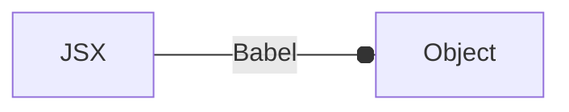

# React and Nextjs
## React Basics
- Single page application (SPA)
- DOM Manipulation --> repainting when browsing pages
- **React fragments** used to wrap multiple elements
- Components name need to be start with *capitals*
- Injecting JS in the JSX requires only `Evaluated JS expression` and not any **JS expression**

## custom react syntax

**the react components (JSX) are transpiled into an object like syntax which is rendered inside the DOM**
The object structure is similar to the given below:


```js
// React.createElement(type, attributes, text, variables)

const myElement = {
    type: 'a',
    children: 'Click here',
    props: {
        href: 'https://github.com'
        target: '_blank'
    }
}

//  using React to create the custom elements
// that don't require parsing

React.createElement(
    'a',
    {href: 'google.com', target: '_blank'},
    "click me",
)
```